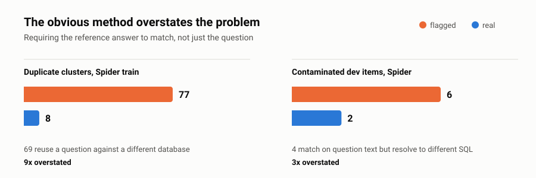

# bird-critic-audit

A reproducible integrity audit for Hugging Face datasets, and the reports it produces for the benchmarks people quote most.

Benchmarks get cited long before anyone checks whether their items are distinct. This is the check: one dependency-free script that validates the schema, flags degenerate records, and measures how much of a dataset is genuinely redundant.

**Six benchmarks measured so far. All six come out clean.** That is the finding, and it is reported as-is rather than dressed up into a scandal.

<picture>
  <source media="(prefers-color-scheme: dark)" srcset="assets/overstatement-dark.svg">
  
</picture>

## Try it without installing anything

A hosted version runs the same audit on any Hugging Face dataset id:
**[Dataset Integrity Auditor](https://huggingface.co/spaces/Ashsinha1/dataset-integrity-auditor)**

Source for the Space is in [`space/`](space/).

## Audit your own dataset

```bash
git clone https://github.com/ashishsinha1602/bird-critic-audit && cd bird-critic-audit
pip install datasets

python audit.py fetch --dataset <your/dataset> --split train --out data.jsonl
python audit.py prep --data data.jsonl --text-field question --answer-field answer
```

`prepared/REPORT.md` will tell you how much of it is redundant. No configuration beyond naming the two fields.

## Results

| Dataset | Records | Schema issues | Degenerate | Identical dupes | Identical % | Variant clusters | Groups | Largest group |
|---|---|---|---|---|---|---|---|---|
| BIRD-CRITIC 1.0 (open) | 600 | 0 | 0 | 2 | 0.33% | 3 | 15 | 13.8% |
| Spider (train) | 7000 | 0 | 0 | 16 | 0.23% | 69 | 140 | 2.4% |
| Spider (dev) | 1034 | 0 | 0 | 0 | 0.0% | 3 | 20 | 11.6% |
| GSM8K (train) | 7473 | 0 | 0 | 0 | 0.0% | 1 | – | – |
| GSM8K (test) | 1319 | 0 | 0 | 0 | 0.0% | 0 | – | – |
| HumanEval | 164 | 0 | 0 | 0 | 0.0% | 0 | – | – |

Six datasets, 17,590 records, **18 genuinely duplicated records in total**. Full table in [`COMPARISON.md`](COMPARISON.md); per-dataset reports under [`prepared/`](prepared/).

## The distinction that matters

A naive text-similarity pass reports **77 duplicate clusters** in Spider's training split. Only **8** of them are real.

The other 69 share a question stem while differing in the reference SQL, the database, or both — one phrasing reused against different schemas, which is deliberate construction rather than redundancy. In BIRD-CRITIC the same pattern appears: 4 clusters flagged, 1 genuine. `PostgreSQL_215` and `PostgreSQL_216` ask an identical question, one filed under `Personalization` and one under `Efficiency`, with different `issue_sql`.

Reporting the raw cluster count overstates the problem by roughly **9x** on Spider and **4x** on BIRD-CRITIC. `audit.py` separates the two and reports both numbers, because only records identical across every evaluated field let a model bank the same answer twice.

The same gap shows up again in cross-split contamination below: counting identical questions says 6 Spider dev items are contaminated, while additionally requiring the reference SQL to match says 2. Both measurements point one way — **the obvious implementation of a contamination check overstates the problem, and the correction is to require the answer to match, not just the question.**

The number worth carrying into any claim about generalisation is not duplication but concentration. BIRD-CRITIC draws 600 records from 15 databases, the largest supplying 13.8% of all items. Spider's training split is far more diverse at 140 databases and a 2.4% maximum. Both are design properties rather than errors, but they mean the two benchmarks reward schema-specific familiarity to very different degrees.

## Cross-split contamination

Overlap between a training split and the split used to score a model inflates that score directly, which makes it more consequential than duplication inside either split. `audit.py leak` measures it.

| Check | Spider train → dev | GSM8K train → test |
|---|---|---|
| Records compared | 7,000 → 1,034 | 7,473 → 1,319 |
| Identical question | 6 (0.58%) | 0 |
| Identical reference answer | 8 (0.77%) | 0 |
| **Both identical — answerable from memory** | **2 (0.19%)** | **0** |
| Near-duplicate question (Jaccard ≥ 0.70) | 7 (0.68%) | 0 |
| Shared group values | 0 databases | – |

**GSM8K has zero measurable train/test overlap** — not one identical question, answer, or near-duplicate. Because that result came from LSH, which offers no recall guarantee, it was re-run under exact cross-product search over all 9,852,887 pairs: still zero, in 13 seconds. A zero from an approximate method is exactly where verification is worth the cost.

**Both benchmarks' split separations hold.** Spider's two splits share no databases at all, so an identical question across them is being asked of entirely different data.

The collisions are what you would expect once you look: every one is a degenerate row-count question landing on a coincidentally same-named table. *"What is the total number of airlines?"* appears in both, against `flight_2` and `flight_4`, and both reduce to `SELECT count(*) FROM AIRLINES`. Same for `SELECT count(*) FROM Documents` across `cre_Doc_Template_Mgt` and `cre_Docs_and_Epenses`.

Two dev items out of 1,034 could be answered from memorized training data. Both are trivial counts. That is not contamination worth adjusting a score for — but it is worth having measured rather than assumed.

Reporting only the "identical question" row would have put the number at 6 and the framing at *three times worse than it is*. Requiring the reference answer to match too is what makes the metric mean anything.

## Does the fast path agree with the slow one?

Above 3,000 records exact all-pairs comparison stops being practical, so the script switches to MinHash-LSH. That is a different algorithm, and swapping algorithms mid-table without checking is how comparisons quietly become meaningless.

Run on Spider's dev split, where both methods are feasible:

| Method | Candidate pairs examined | Pairs found | Clusters |
|---|---|---|---|
| exact all-pairs | 534,061 | 3 | 3 |
| MinHash-LSH | 232 | 3 | 3 |

Identical output from 0.04% of the work. LSH generates candidates only — every reported pair is then verified with its true Jaccard score, so similarity values mean the same thing under both methods.

Reproduce it with `--lsh-threshold 0`, which forces LSH on a dataset small enough to check by brute force.

## Usage

```bash
pip install datasets

python audit.py fetch --dataset xlangai/spider --split train --out spider-train.jsonl
python audit.py prep  --data spider-train.jsonl --preset spider --name "Spider (train)" --out-dir prepared/spider-train
python audit.py compare "prepared/*/summary.json" --out COMPARISON.md

python audit.py leak --a spider-train.jsonl --b spider-dev.jsonl --preset spider   --name-a "Spider train" --name-b "Spider dev" --out-dir prepared/spider-leak
```

Any dataset works, not just the presets — point the field roles at the right columns:

```bash
python audit.py prep --data mydata.jsonl \
  --text-field question --answer-field answer --group-field source \
  --label-fields difficulty,topic
```

Three roles drive everything: `text` is the natural-language side, `answer` the reference solution, `group` the schema or source an item is drawn from. Presets exist for `bird-critic` and `spider`.

For BIRD-CRITIC, note the split is named `open`, not `train` — `split='train'` raises `ValueError: Unknown split "train"`.

`audit.py` is pure standard library; `datasets` is needed only by `fetch`.

## What `prep` measures

1. **Schema** — infers the majority type of every field and flags records that deviate or omit it.
2. **Degenerate records** — empty text, answer, or group fields.
3. **Exact duplicates** — on normalized text, and separately on comment-stripped reference SQL.
4. **Near-duplicates** — 3-word-shingle Jaccard at a 0.70 threshold, exact below 3,000 records and MinHash-LSH above.
5. **Cluster classification** — union-find over near-duplicate pairs, then a split into *fully identical* and *shared-stem variant*.
6. **Concentration** — distinct groups, mean items per group, largest group share.

`leak` additionally measures, for two splits: identical text, identical reference answers, records where **both** match the same source record, near-duplicate text across splits, and whether the splits share any group values at all.

Outputs `summary.json` (machine-readable), `REPORT.md` (human-readable), and `prepared.jsonl` (normalized records with comparison keys attached; skip with `--no-prepared`).

## Limitations

LSH recall is not guaranteed, so counts on datasets above the switch threshold are **lower bounds**. The dev-split check above found no loss, but one clean result is not a proof. Every report states which method produced it.

Similarity is computed over the text field only. Reference SQL is compared exactly, after stripping comments and collapsing whitespace, because near-identical SQL is common across genuinely independent problems and would produce noise rather than signal.

Cross-split contamination is measured only between the two splits you pass to `leak`. It says nothing about overlap with a model's pretraining corpus, which is the larger and much harder contamination question.

The 0.70 threshold and 3-word shingle size are constants at the top of `audit.py`, exposed as `--threshold`. They are defensible defaults, not tuned optima.

## License

MIT
